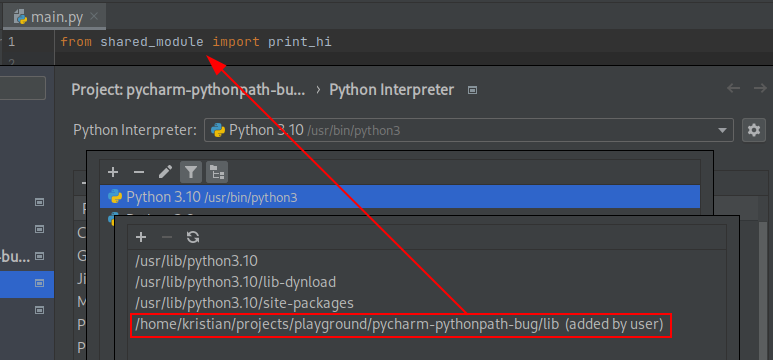
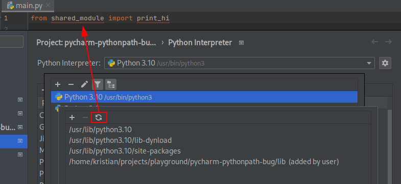

# Demonstration of PyCharm's PYTHONPATH bug

When adding a directory to PyCharm's python interpreter path, Pycharm fails to index from these paths after reopening Pycharm

## Steps to reproduce

1. Clone this repository
2. Open this project in PyCharm
3. Add `/path/to/this/project/lib` via `Project settings > Python Interpreter > (Cogwheel) > Show all > Show path for selected interpreter`
4. Open `main.py` and confirm that `from shared_module import print_hi` does not show `Unresolved reference`
5. Either:
   1. Restart PyCharm and reopen this project
   2. Go back to `Show path for selected interpreter` settings page and hit `Refresh`
6. Confirm that `from shared_module import print_hi` is showing `Unresolved reference` error

> When using the `Refresh` method, every other refresh will index it correctly

## Screenshots

After adding `lib/` folder to path:

After first library `Refresh`:

> From this point on, second refresh fixes it, third refresh breaks it again and so on...
